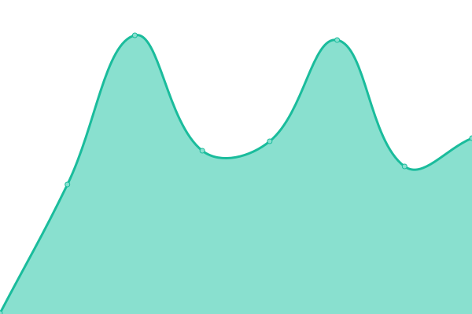
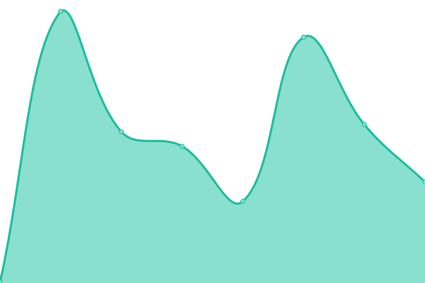

# [📈 Live Status](https://kittygirlyy.github.io/status): <!--live status--> **🟩 All systems operational**

This repository contains the open-source uptime monitor and status page for [❤](8086.re)

<!--start: status pages-->
<!-- This summary is generated by Upptime (https://github.com/upptime/upptime) -->
<!-- Do not edit this manually, your changes will be overwritten -->
<!-- prettier-ignore -->
| URL | Status | History | Response Time | Uptime |
| --- | ------ | ------- | ------------- | ------ |
|  [8086.re](https://8086.re) | 🟩 Up | [8086-re.yml](https://github.com/kittygirlyy/status/commits/HEAD/history/8086-re.yml) | 

 376ms
     
 | 

<a href="https://kittygirlyy.github.io/status/history/8086-re">100.00%</a>
    

|  [0xaa55.re](https://meow.0xaa55.re) | 🟩 Up | [0xaa55-re.yml](https://github.com/kittygirlyy/status/commits/HEAD/history/0xaa55-re.yml) | 

 259ms
     
 | 

<a href="https://kittygirlyy.github.io/status/history/0xaa55-re">100.00%</a>
    

|  [PurfectKittens](https://purfectkittens.github.io/kittens-website/) | 🟩 Up | [purfect-kittens.yml](https://github.com/kittygirlyy/status/commits/HEAD/history/purfect-kittens.yml) | 

 89ms
     
 | 

<a href="https://kittygirlyy.github.io/status/history/purfect-kittens">100.00%</a>
    

<!--end: status pages-->
